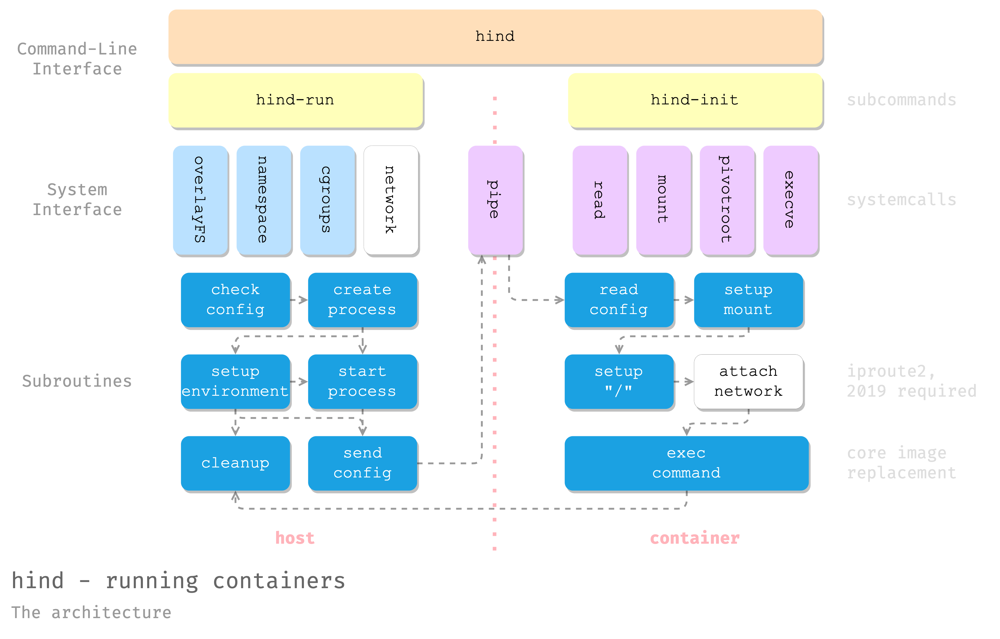

# hind: yet another naive container runtime

> HIND Is Not Docker.

See also: 

- [cdfmlr/pish](https://github.com/cdfmlr/pish): a python rewrite of this project, focusing on simplicity and readability.
- [LZJ0913/Hind](https://github.com/LZJ0913/Hind): a fork of this project, with network features.

## Usage

```
go build .
sudo ./hind run -it NOIMG /bin/sh
sudo ./hind run -it NOIMG /bin/ls -alh
```

- `NOIMG`: run image is not implemented. A placeholder.

### cgroups

宿主机：

```sh
$ stress --vm-bytes 800m --vm-keep -m 1
stress: info: [6364] dispatching hogs: 0 cpu, 0 io, 1 vm, 0 hdd
$ top
  PID USER      PR  NI    VIRT    RES    SHR S  %CPU %MEM     TIME+ COMMAND
 6365 foo       20   0  826524 819500    460 R 100.0 10.1   0:08.43 stress
```

容器：

```sh
$ sudo go run . run -ti --memory-limit-bytes=1024000 noimg stress --vm-bytes 800m --vm-keep -m 1
2023/06/17 11:39:11 INFO [cmd/run] Create and run a new container opts="{Tty:true Interactive:true Image:noimg Command:[stress --vm-bytes 800m --vm-keep -m 1] Resources:{CpuQuotaUs:0 CpuPeriodUs:0 CpuSetCpus: MemoryLimitBytes:1024000}}"
2023/06/17 11:39:11 INFO [host] Run command in container tty=true command="[stress --vm-bytes 800m --vm-keep -m 1]" resources="{CpuQuotaUs:0 CpuPeriodUs:0 CpuSetCpus: MemoryLimitBytes:1024000}"
2023/06/17 11:39:11 INFO [host] container process started pid=6719
2023/06/17 11:39:11 INFO [cmd/init] Booting container
2023/06/17 11:39:11 INFO [container] RunContainerInitProcess: bootstrapping container
2023/06/17 11:39:11 INFO [cgroups] V1fsManager setResource value=0 target=/sys/fs/cgroup/cpuset/hind/container/cpuset.cpus
2023/06/17 11:39:11 INFO [cgroups] V1fsManager setResource value=0 target=/sys/fs/cgroup/cpuset/hind/container/cpuset.mems
2023/06/17 11:39:11 INFO [host] Cgroup manager created manager="&{BasePath:/sys/fs/cgroup/ cgroupName:hind/container}"
2023/06/17 11:39:11 INFO [cgroups] V1fsManager setResource value=1024000 target=/sys/fs/cgroup/memory/hind/container/memory.limit_in_bytes
2023/06/17 11:39:11 INFO [host] Cgroup setup done
2023/06/17 11:39:11 INFO [host] Command sent, closing the pipe (w).
2023/06/17 11:39:11 INFO [container] pid 1 received command command="[stress --vm-bytes 800m --vm-keep -m 1]"
2023/06/17 11:39:11 INFO [container] pid 1 setup mount
2023/06/17 11:39:11 INFO [container] pid 1 found command in path exe=/bin/stress
2023/06/17 11:39:11 INFO [container] pid 1 ready to execve the command. Bootstrapping done. Bye. command="[stress --vm-bytes 800m --vm-keep -m 1]"
stress: info: [1] dispatching hogs: 0 cpu, 0 io, 1 vm, 0 hdd
stress: FAIL: [1] (415) <-- worker 6 got signal 9
stress: WARN: [1] (417) now reaping child worker processes
stress: FAIL: [1] (421) kill error: No such process
stress: FAIL: [1] (451) failed run completed in 11s
2023/06/17 11:39:22 INFO [host] container process exited
2023/06/17 11:39:22 WARN [cgroups] TODO: V1fsManager.Destroy()
```

内存不够用，stress 被 OOM 杀掉了。

整小一点：

```sh
$ sudo go run . run -ti --memory-limit-bytes=1024000 noimg stress --vm-bytes 1m --vm-keep -m 1
```

可以运行了，：

```sh
  PID USER      PR  NI    VIRT    RES    SHR S  %CPU %MEM     TIME+ COMMAND
 8850 root      20   0    8348    660    444 D   8.6  0.0   0:00.76 stress
```

一直交换，所以 CPU 占用也下来了。

放宽限制 CPU 就上来了：

```sh
$ sudo go run . run -ti --memory-limit-bytes=2024000 noimg stress --vm-bytes 1m --vm-keep -m 1
$ top
  PID USER      PR  NI    VIRT    RES    SHR S  %CPU %MEM     TIME+ COMMAND
10269 root      20   0    8348   1624    532 R  93.8  0.0   0:04.86 stress
```

### Image

可以使用 `docker export` 把一个 Docker「容器」导出为一个 hind「镜像」（TODO: 直接用 Docker 镜像作为 hind 镜像）：

```sh
docker run hello-world
docker ps -a | grep hello-world # | cut -d ' ' -f 1 # 总之就是获取容器 ID
sudo docker export -o hello-world.tar c3117d3a1c4c

mkdir hello-world && tar -xvf hello-world.tar -C hello-world
./hello-world/hello # 里面打包的一个可执行文件，本机可运行
```

> ⚠️ [`be4680c`](https://github.com/cdfmlr/hind/commit/be4680cd88f90cafbab888600d8e592474425b2e) 开始，支持了 OverlayFS，可以直接用 docker export 得到的 tar 包作为 hind 镜像。一般情况下，不再需要手动解压。详见下文 [OverlayFS](#OverlayFS)。

在容器运行 `hind run -ti <image> <command>`，其中 image 为解压出来的镜像根目录：

```sh
sudo go run . run -it ./hello-world/ /hello
```

使用「host 自身」作为「镜像」：将 `<image>` 设为 `/`即可:  

```sh
sudo go run . run -it / uname -a
```

- 历史兼容: 也可以用 `NOIMG` 作为 image，等价于使用 `/`。

Alpine: 

```sh
$ /bin/cat /etc/os-release
NAME="CentOS Linux"
VERSION="7 (Core)"
ID="centos"
ID_LIKE="rhel fedora"
VERSION_ID="7"
PRETTY_NAME="CentOS Linux 7 (Core)"
ANSI_COLOR="0;31"
CPE_NAME="cpe:/o:centos:centos:7"
HOME_URL="https://www.centos.org/"
BUG_REPORT_URL="https://bugs.centos.org/"
$ sudo ./hind run -ti images/alpine /bin/cat /etc/os-release
NAME="Alpine Linux"
ID=alpine
VERSION_ID=3.18.2
PRETTY_NAME="Alpine Linux v3.18"
HOME_URL="https://alpinelinux.org/"
BUG_REPORT_URL="https://gitlab.alpinelinux.org/alpine/aports/-/issues"
```

Hind 现已反哺其自身的开发了。使用 hind 来测试 hind，避免可能的错误破坏宿主环境：

```sh
$ sudo go run . run -ti NOIMG sh -c "cd /home/foo/writingadocker/hind; go test -v -run Test_initOverlayFS ./container && go test -v -run Test_destroyOverlayFS ./container"
=== RUN   Test_initOverlayFS
--- PASS: Test_initOverlayFS (0.01s)
PASS
ok      hind/container  0.008s
=== RUN   Test_destroyOverlayFS
--- PASS: Test_destroyOverlayFS (0.04s)
PASS
ok      hind/container  0.044s
```

### OverlayFS

Hind 支持 overlay file system，即在一个只读的「镜像」上，再叠加一个可写的「容器层」。
容器层的修改不会影响到只读镜像，也不会影响到其他使用同一个只读镜像的其他容器。
容器层会在容器退出时被销毁。

```sh
$ sudo hind run -ti images/alpine.tar sh
```

- overlay 功能默认启用：在 hind run 时，会创建临时目录作为容器层，并在容器退出时被销毁之。
   - 若 IMAGE 参数为 tar 包，则 hind 会自动解压 tar 包到临时目录，并使用该解压出来的目录作为镜像。该目录会在容器退出时被销毁。
   - 若 IMAGE 参数为目录，则 hind 会直接使用该目录作为镜像层。OverlayFS 保证该目录不会被容器修改。容器退出时，不会销毁该目录。
   - 若希望禁用 overlay 功能，可以使用 `--no-overlay` 参数。`--no-overlay` 要求 IMAGE 参数为目录，否则强制使用 overlay。禁用 overlay 功能时，容器直接使用 IMAGE 参数指定的目录作为根目录，并且拥有对该目录的**读写**权限。容器退出时，不会销毁该目录，容器所修改的内容会被保留。


## 设计与实现

### 整体架构



Hind 由一个宿主进程（`hind-run`）和一个容器进程（`hind-init`）组成。宿主进程负责解析命令行参数，创建容器进程，并为其设置 namespace、cgroup、overlayfs 等环境，等待子进程退出，然后清理环境并退出。容器进程设置容器的 rootfs、procfs 等环境，最后执行用户指定的命令。

### 项目结构

```
.
├── cgroups
│   ├── interfaces.go
│   ├── resources.go
│   │   resources_test.go
│   ├── utils.go
│   │   utils_test.go
│   ├── v1fs.go
│       v1fs_test.go
├── cmd
│   ├── init.go
│   ├── root.go
│   └── run.go
├── container
│   ├── config.go
│   ├── overlayfs.go
│   │   overlayfs_test.go
│   ├── pid1.go
│   └── run.go
├── go.mod / go.sum
└── main.go
```

相较于 [pish](https://github.com/cdfmlr/pish)，hind 进行了比较完善的工程化实现和自动化测试。Hind 对于边缘、异常情况应该有更加鲁棒。但相对地，hind 的代码量也远超 pish：

```
---------------------------------------------------------------
Language     files          blank        comment           code
---------------------------------------------------------------
Go              16            344            310           1607
Markdown         1             41              0            129
---------------------------------------------------------------
SUM:            17            385            310           1736
---------------------------------------------------------------
```


### 模块设计

#### cgroups

`cgroups` 包提供了对 cgroups 的管理功能。定义了一个 `Manager` 接口和相关的资源类型和方法。

`Manager` 接口定义了对cgroup的管理操作，包括创建cgroup、将进程应用到cgroup、设置资源限制和销毁cgroup。该接口的实现与特定的cgroup接口绑定，支持以下几种类型：

- cgroup v1文件系统：V1fsManager
- cgconfig.service（已弃用，不再支持）
- cgroup v2文件系统（未实现）
- systemd（未实现）


`V1fsManager` 类型是一个实现了Manager接口的结构体，它通过与cgroup v1文件系统交互来管理cgroup。它具有以下方法：

- `NewV1fsManager`：用于创建一个V1fsManager实例的快捷方式，该实例会自动创建指定名称的cgroup。
- `Create`：创建一个具有指定名称的cgroup，并在相应的子系统中创建相关目录。
- `Apply`：将指定的进程添加到cgroup中。
- `Set`：设置cgroup的资源限制，根据传入的Resources对象进行设置。
- `Destroy`：销毁cgroup，删除与之关联的所有资源。

`Resource` 接口定义了cgroup的配置项，例如memory.limit_in_bytes。一个资源有一个值，可以是结构体、整数、字符串或其他类型。只需实现Value()方法以提供其值，该值将写入cgroup的配置文件中。

`V1fsResource` 接口是针对cgroup v1文件系统的资源接口。它是V1fsManager所要求的接口，并需要额外实现V1fsPath方法来返回资源的配置文件路径。

除了上述方法之外，还有一些辅助方法用于执行文件操作、检查路径和文件系统类型等。

#### overlayfs

基于 Linux 的 overlay 文件系统，我们实现容器的分层存储和隔离。具体来说，我们在 container 包中实现了几个主要的函数和结构：

- `overlayConfig` 是一个容器的配置结构，它包含了 overlay 文件系统所需的各种路径和参数，例如 lowerdir, upperdir, workdir, mountpoint 等。
- `makeOverlayFS` 是一个创建 overlay 文件系统的函数，它首先检查镜像路径是否是一个目录，如果不是，就将镜像文件解压到临时目录作为 lowerdir。然后，它创建 upperdir, workdir 和 mountpoint，并调用 mountOverlayFS 来挂载 overlay 文件系统。
- `extractImage` 是一个解压镜像文件的函数，它使用 tar 命令将镜像文件解压到目标路径。
- `mountOverlayFS` 是一个挂载 overlay 文件系统的函数，它使用 mount 命令并指定 overlay 类型和各种选项来挂载 overlay 文件系统。
- `destroyOverlayFS` 是一个清理 overlay 文件系统的函数，它调用 `unmountOverlayFS` 来卸载 overlay 文件系统，并删除临时目录。
- `unmountOverlayFS` 是一个卸载 overlay 文件系统的函数，它使用 umount 命令来卸载 overlay 文件系统。

#### run

`run.go` 提供了容器的运行时环境，包括容器的根目录、进程环境、文件系统环境等。并启动容器进程。

代码的主要逻辑如下：

- 定义一个`Container`结构体，用来存储容器的相关信息，如ID, Name, ImagePath, Command, Resources等。
- 定义了一个`Run`函数，用来在主机命名空间中创建并运行一个容器。该函数接受一个`Container`类型的参数，并返回一个错误类型的值。
- 在`Run`函数中，首先调用了`checkContainer`函数，用来检查容器的必要字段是否存在，并为可选字段设置默认值。
- 然后创建了一个管道（pipe），用来向容器进程发送命令。
- 接着调用了`NewParentProcess`函数，用来创建一个容器进程，该进程将成为容器中的PID 1。该函数返回一个`*exec.Cmd`类型的值，表示容器进程的执行对象。
- 调用`containerExe.Start()`方法，启动容器进程。
- 使用`defer`语句，在函数退出时清理工作目录（work dir）。
- 调用`setupCgroup`函数，用来为容器设置cgroup（控制组），即资源限制和度量的一种机制。² 该函数返回一个清理函数（cleanUpFunc），用于在函数退出时销毁cgroup。
- 调用`setupRootDir`函数，用来为容器设置根目录（root dir），即容器中可见的文件系统。该函数根据容器的ImagePath和Overlay字段，决定是否使用overlayfs（一种联合文件系统）³ 来创建根目录。该函数也返回一个清理函数，用于在函数退出时销毁根目录。
- 调用`sendConfig`函数，用管道向容器进程发送配置信息，包括根目录和命令。
- 关闭管道的写端。
- 调用`container.Process.Wait()`方法，等待容器进程结束，并获取其状态（state）。

#### pid1

在容器中，PID 1 进程是容器的第一个进程，它负责初始化容器的环境，然后启动容器中的其他进程。在本项目中，PID 1 进程的代码在 `pid1.go` 中。

该代码定义了两个主要功能：NewParentProcess和RunContainerInitProcess。前者会创建一个命令，该命令将第二个命令作为容器内的PID 1进程执行。后者从管道接收一些配置，为容器的文件系统设置挂载点，并用实际的应用程序命令替换自己。

其具体工作的流程如下：

- 创建一个命令，该命令将执行与当前进程相同的二进制文件，但使用不同的入口点（`init`）。
- 为命令设置一些属性，例如要创建的命名空间和要传递的文件描述符。
- 执行命令，该命令成为容器内的 PID 1 进程。
- 从管道接收一些配置，例如根目录和应用程序命令。
- 使用 `pivotRoot` 和 `mount` 设置容器文件系统的挂载点。
- 使用 `execve` 将自己替换为应用程序命令。

#### cmd

在 `cmd` 包中，我们定义了 hind 的命令行用户接口。它使用 `cobra` 库来解析命令行参数，并调用 `container` 包中的函数来执行相应的操作。
